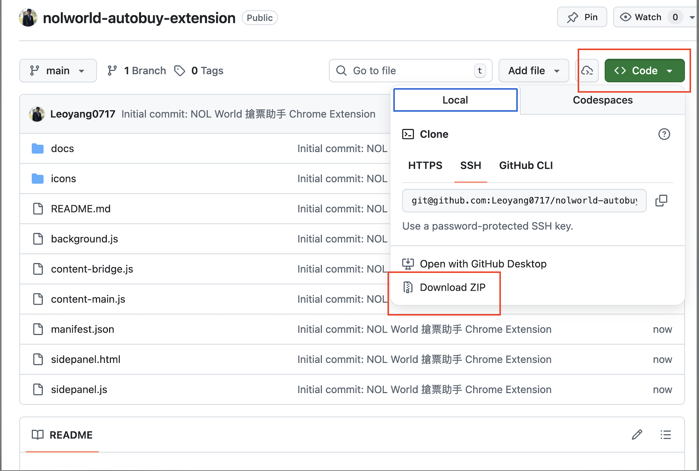
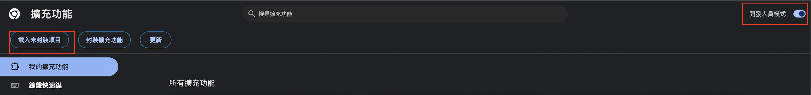
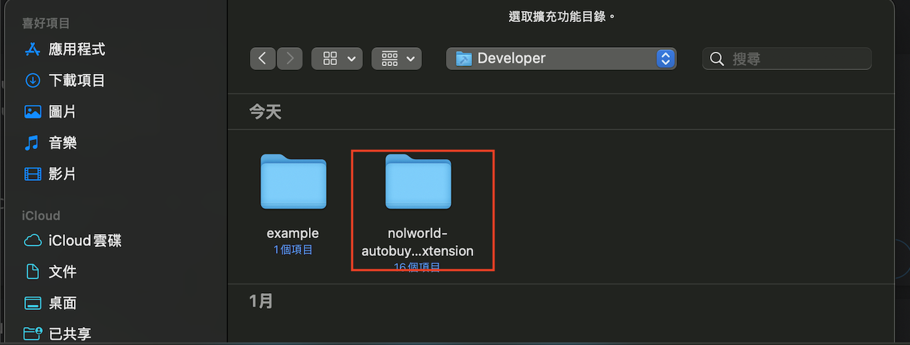
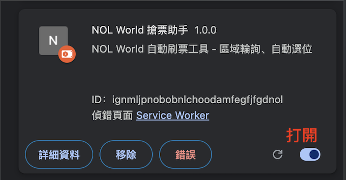
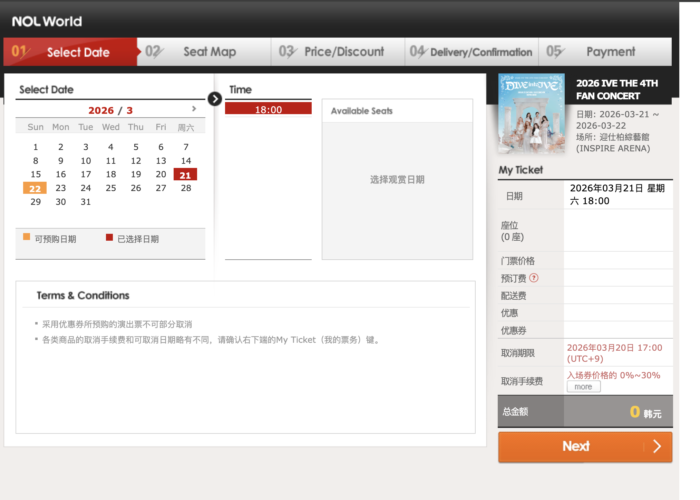
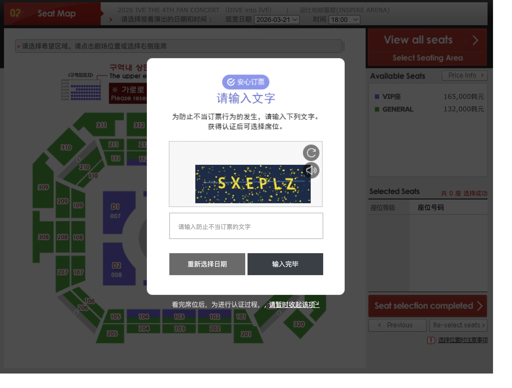
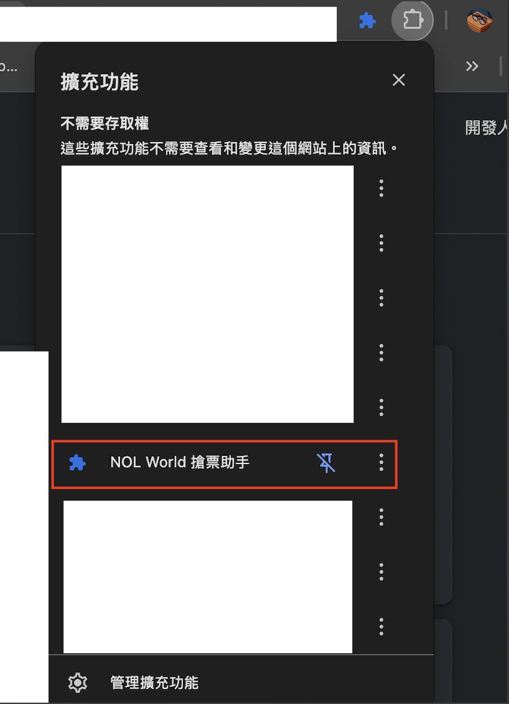
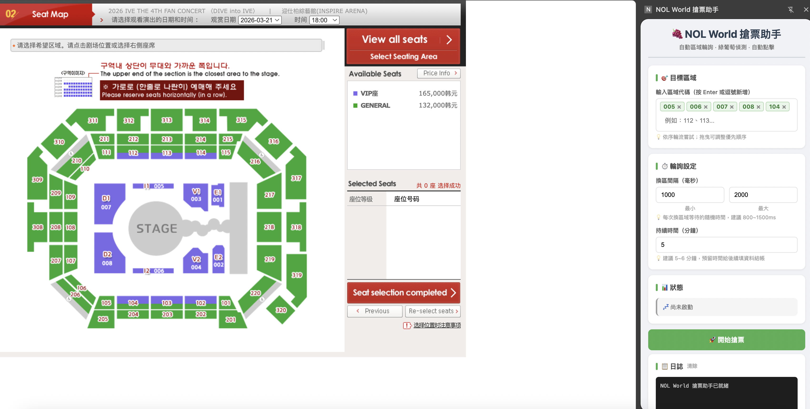
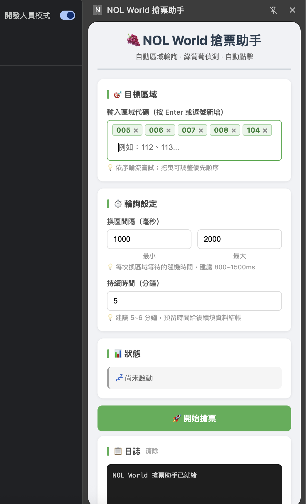

# 🍇 NOL World 搶票助手

自動輪詢區域、偵測可用座位（綠葡萄）、自動點擊並完成到填寫個資頁面的 Chrome 擴充功能。

> 適用網站：[gpoticket.globalinterpark.com](https://gpoticket.globalinterpark.com)、[tickets.interpark.com](https://tickets.interpark.com)

---

## 功能總覽

| 功能 | 適用頁面 | 說明 |
|------|----------|------|
| 🛰️ 偵察模式刷票（推薦） | gpoticket（葡萄座位圖） | 每 1~1.2 秒背景請求逐區輪詢（不點畫面、直接讀座位資料），發現可選座位立即用頁面函式**直接選位提交**（繞過進場點擊），再自動選票數、進個資頁 |
| 🔄 盲輪模式刷票 | gpoticket | 逐區點擊、等座位圖載入後查看，速度較慢但請求指紋乾淨、較不觸發驗證，為偵察撞驗證時的穩定備援 |
| ⏰ 預約搶先點擊 | tickets.interpark.com（預約頁） | 監聽預約按鈕，開賣解鎖瞬間自動連點 3 次 |
| 🎯 座位圖監聽 | tickets.interpark.com（React 選座頁） | 監聽指定 Row（或全場），座位一解鎖立即點擊並自動 Submit |
| 🔒 驗證碼自動處理 | gpoticket | 偵察模式：自動彈出驗證視窗、解完自動恢復；盲輪模式：停止並警示 |
| ⛔ Access Denied 自動處理 | gpoticket | 刷太快被擋時自動暫停 11 秒再繼續；連續失敗才停止並強烈警報 |

---

## 安裝教學

### 1. 下載專案

點擊右上角 **Code → Download ZIP**，解壓縮到任意資料夾。



或使用 git clone：

```bash
git clone https://github.com/你的帳號/nolworld-autobuy-extension.git
```

### 2. 開啟 Chrome 擴充功能頁面

在網址列輸入：

```
chrome://extensions
```

### 3. 開啟開發人員模式

右上角切換「**開發人員模式**」為開啟（藍色），接著點擊「**載入未封裝項目**」。



### 4. 選擇資料夾

選擇剛才解壓縮的資料夾（包含 `manifest.json` 的那個）。



### 5. 確認安裝成功

擴充功能清單中出現「**NOL World 搶票助手**」即完成。建議將圖示釘選到工具列，方便之後點擊。



---

## 使用教學

### 步驟一：進入座位選擇頁面

前往 NOL World 售票頁面，依序完成以下步驟後再開啟擴充功能：

1. 選擇活動日期與場次

   

2. 輸入驗證碼（CAPTCHA）並通過驗證

   

3. 確認已進入 **Seat Map（座位圖）** 頁面

> ⚠️ **請在通過驗證碼、看到座位圖後才開啟 Panel 並開始搶票。** 在驗證碼頁面之前就啟動，程式將無法正確運作。

### 步驟二：開啟側邊面板

點擊 Chrome 工具列右上角的 🍇 圖示，側邊面板會從右側滑出。若找不到圖示，請先點擊拼圖🧩圖示將擴充功能釘選。





### 步驟三：設定目標區域

在「**目標區域**」欄位輸入想搶的區域代碼，按 **Enter** 或逗號新增。

區域代碼可在座位圖右側的區域列表找到，例如：

```
001、002、112、113、316、317、318
```

可新增多個區域，程式會依序輪流嘗試。點擊 `×` 可移除。



### 步驟四：選擇模式與設定

**🛰️ 偵察模式（預設，推薦）**

不點擊畫面，改用背景請求逐區讀取各區域座位資料——每次在隨機範圍內等待後發出一個請求、輪流換區，回應約 0.15 秒就能判讀完，不用等座位圖渲染。發現可選座位時，**直接用頁面函式選位提交**（「發現即提交」，繞過進場、點座位、確認等步驟），從命中到送出幾乎零延遲。

| 設定 | 說明 | 建議值 |
|------|------|--------|
| 請求間隔（隨機範圍）| 每次發偵察請求前在此範圍隨機等待（時序不固定，較不像機器人）| **1000~1200 ms** |
| 持續時間 | 自動停止前的總執行時間 | 5～6 分鐘 |

> 📐 **每個區域被檢查的週期 = 請求間隔 × 區域數**。例如 1100ms × 10 區 = 每區每 11 秒看一次（盲輪同樣 10 區一圈約 13 秒，因每區多花約 400ms 載入座位圖）。
>
> ⚠️ **風控門檻是浮動的**：離峰安全的間隔，開賣尖峰可能觸發驗證。實測 1000~1200ms 較不會觸發、800~1000ms 仍會。被驗證/被擋就把兩個值一起調大；若一直遇驗證，改用盲輪模式（見下方換算）。

**🔄 盲輪模式（備援）**

傳統做法：逐區點擊 → 等座位圖載入 → 查看有無座位 → 換下一區。速度較慢（每區約 1.3 秒），但用的是 iframe 導航請求，指紋乾淨、較不觸發驗證。偵察模式初始化失敗時也會自動降級成此模式。

| 設定 | 說明 | 建議值 |
|------|------|--------|
| 換區間隔（最小/最大）| 每次換區域前的隨機等待時間 | 800 / 1000 ms |

**🔁 兩模式間隔換算（UI 會即時顯示）**

偵察與盲輪的間隔不能直接比——盲輪每輪多花約 400ms 載入座位圖、偵察命中後又幾乎零延遲。UI 在兩個間隔欄位下方會即時算出「相同掃描速度」的等效值：

> 盲輪間隔 ≈ 偵察間隔 − 400 − 400 ÷ 區域數

例如偵察 2000~2200ms（10 區）≈ 盲輪 1560~1760ms。**偵察一直撞驗證時,就照這個等效值改設盲輪**,速度不變但更耐驗證,還可再往下調試更快。

> **為什麼持續時間建議 5～6 分鐘？** NOL World 每 10 分鐘會重置訂票 session。找到座位後還需要時間填寫個資與結帳，建議留足夠的緩衝時間，避免 session 在付款前過期。

### 步驟五：開始搶票

點擊「**🚀 開始搶票**」按鈕。狀態列會顯示目前模式與偵察輪數。

發現可選座位後，程式會自動完成後續。**兩種模式在「選位」這段走法不同：**

- **偵察模式（發現即提交）**：直接從偵察回應解析座位參數，用頁面函式送出選位——**跳過下表步驟 1~5 的進場、點座位、確認**，命中到送出幾乎零延遲，再接步驟 6~9。
- **盲輪模式**：走完整步驟 1~9。

| 步驟 | 動作 | 等待時間 |
|------|------|----------|
| 1 | 點擊目標區域（盲輪：命中的那一區） | — |
| 2 | 等待座位圖載入，掃描可用座位 | 依 iframe 載入 |
| 3 | 點擊該區域第一個可用座位 | — |
| 4 | 等待伺服器確認座位選取 | 150 ms |
| 5 | 點擊確認按鈕（Seat selection completed） | — |
| 6 | 輪詢等待票數頁面載入（最多 5 秒） | 200ms 間隔 |
| 7 | 自動設定票數為 1 張 | — |
| 8 | 等待票數選單計算完成 | 300 ms |
| 9 | 點擊下一步，進入填寫個資頁面 | — |

偵察命中但撲空（票剛被別人搶走、提交沒進到票數頁）不會停止，會立刻恢復偵察繼續掃；解析或函式失敗則自動 fallback 回完整的進場點擊流程。

> ⚠️ **目前限制**
> - **每次只能購買 1 張票**，不支援多張
> - **無法指定座位**，程式會自動選取該區域出現的第一個可用葡萄(不分顏色)
> - 想搶特定區域請在「目標區域」設定，但座位由系統隨機分配

找到座位時會：
- 發出三聲提示音 🔔（各種提示音的區別見下方[提示音說明](#提示音說明)）
- 顯示 Chrome 桌面通知
- 日誌顯示金色文字

### 刷票中的自動防護處理

**🔒 驗證碼自動處理（偵察模式）**：偵察太頻繁時，伺服器會把 session 標記為需要驗證（回應變成 `CaptchaOpen` 指令）。此時程式會：

1. **暫停偵察**（不是停止，持續時間照常計算）＋ 播放警示音 ＋ 桌面通知
2. **自動把驗證視窗彈出來**（替頁面執行 CaptchaOpen）
3. 你完成驗證後**自動恢復偵察**，不用重按開始

若驗證視窗無法自動彈出，log 會提示你手動點擊任一區域讓它跳出，解完一樣自動恢復。

**🔒 驗證碼偵測（盲輪模式）**：跳出驗證碼時**自動停止**並警示。請手動完成驗證後，再重新點擊「開始搶票」。

**⛔ Access Denied 自動處理**：刷太快時座位圖區塊可能變成「Access Denied」頁面（被網站暫時擋下），程式會自動：

1. **暫停 11 秒**（不是停止）——播放專屬警報音 + 桌面通知，讓你知道被擋了
2. 11 秒後**自動恢復刷票**，繼續點擊區域
3. **持續時間照常計算**，不會重設。例如第 3 分鐘被擋，恢復時已是 3 分 11 秒，仍會刷到你設定的時間為止
4. 若等待後重試**連續 3 次**都還是 Access Denied（中間完全沒看到正常座位圖），代表封鎖可能已升級，程式會**停止並發出強烈警報**，建議等下一輪排隊再刷，不要立刻硬碰
5. 只要中間任何一次有正常看到座位圖，連續計數就會歸零重算

> 💡 頻繁遇到 Access Denied 代表速率踩到網站的防護線：偵察模式請把「請求間隔」調大，盲輪模式把「換區間隔」調高。

**⚠️ 回應異常偵測（偵察模式）**：如果連續大量偵察回應既不是座位頁、也不是 Access Denied 或驗證（可能是 session 失效、網站改版），程式會**停止並警示**，請重新整理頁面確認狀態後再啟動。

### 步驟六：找到座位後

程式到達填寫個資頁面（Price/Discount → Delivery/Confirmation）後會自動停止。請**盡快手動完成**後續的付款流程。

---

## 預約搶先點擊（tickets.interpark.com）

適用於**開賣前的預約頁面**：預約按鈕在開賣瞬間才會解鎖，手點永遠慢一步。

1. 開啟 tickets.interpark.com 的預約頁面，確認頁面上有反灰（disabled）的預約按鈕
2. 在側邊面板點擊「**👁️ 開始監聽預約按鈕**」
3. 程式以 MutationObserver + 每 50ms 輪詢雙重監聽按鈕狀態
4. 按鈕一解鎖，**自動連點 3 次**（間隔 80ms）確保觸發，並播放提示音 + 通知

---

## 座位圖監聽（tickets.interpark.com 選座頁）

適用於 tickets.interpark.com 的 **React SVG 座位圖選座頁**：座位全灰時先掛著監聽，任何座位一釋出（例如有人放棄付款）立刻搶下。

1. 進入選座頁面，確認看得到 SVG 座位圖
2. （可選）在「**指定 Row**」欄位輸入目標排，格式如 `003:009, 003:010`，逗號分隔；**留空 = 監聽全場**
3. 設定「**監聽時限**」（分鐘，0 = 無限）。頁面 session 有時效，預設 10 分鐘，超時會自動停止並警示，請重新進入頁面再啟動監聽
4. 點擊「**👁️ 開始監聽座位圖**」

座位解鎖時程式會自動：

| 步驟 | 動作 |
|------|------|
| 1 | 立即點擊解鎖的座位（React handler 直接觸發） |
| 2 | 等待 Submit 按鈕解鎖（每 100ms 檢查，最多 3 秒） |
| 3 | 反覆按 Submit（每 150ms）直到選位 API 發出或出現 Select Price 頁 |
| 4 | 播放提示音 + 桌面通知 |

> 💡 **座位被別人先搶走怎麼辦？** 若跳出「座位已被選取」的錯誤視窗，程式會自動關閉視窗、把該座位暫時列入黑名單（3 秒），並立刻重新開始監聽，不需手動介入。

---

## 緊急停止

任何時候按 **F6** 可立即停止搶票。

> **Mac 用戶**：請按 **Fn + F6**

**注意事項：**
- 按下快捷鍵前，請先**點擊一下側邊面板**，確保面板取得焦點
- 確認日誌區域出現「**⏸ 已手動停止**」才代表真正停止
- 若沒有反應，請直接點擊「**⏸️ 停止搶票**」按鈕

---

## 提示音說明

四種提示音的音色和節奏都不同，聽聲音就能判斷發生什麼事，不用盯著螢幕：

| 情境 | 聲音 | 特徵 |
|------|------|------|
| 🍇 搶到票 / 按鈕已點擊 | 三聲高音「嗶嗶嗶」 | 清亮、興奮感（880Hz 正弦波 ×3） |
| 🔒 出現驗證碼 | 兩聲下降音「叭—啵—」 | 低沉、警示感（440→330Hz） |
| ⛔ Access Denied 暫停 | 四聲高低交替「嗶啵嗶啵」 | 急促、機械警報感（方波） |
| 🚨 連續封鎖已停止 | 六聲急促高低警笛 | 最長最刺耳，聽到請人工介入（鋸齒波） |

> 💡 想先試聽：在側邊面板上按右鍵 →「檢查」→ Console 分別輸入 `playFoundBeep()`、`playWarningBeep()`、`playAccessDeniedBeep()`、`playFatalAlarmBeep()`。

---

## 日誌說明

| 顏色 | 意義 |
|------|------|
| 白色 | 一般操作紀錄 |
| 青色 | 成功操作（注入、點擊等） |
| 金色 | 找到綠葡萄！ |
| 紅色 | 錯誤訊息 |

---

## 注意事項

- 本工具僅供個人學習與研究使用
- 使用前請確認已登入 NOL World 帳號
- **搶票期間只能開啟一個 NOL World 訂票頁面**，若同時開啟多個頁面，程式可能送出指令給錯誤的頁面導致異常。找到票並完成付款後才可開啟其他頁面。
- 搶票期間請勿關閉或重新整理售票頁面
- 若中途手動按 Previous 回到選座頁，重新點擊「開始搶票」即可繼續
- 系統每 10 分鐘重置一次，建議每輪設定 5~6 分鐘

---

## 常見問題

**Q：找不到 NOL World 訂票頁面**
A：請先開啟 gpoticket.globalinterpark.com 的活動訂票頁，進入到 Seat Map 頁面後再開啟側邊面板。

**Q：點擊開始後沒有反應**
A：請確認已設定至少一個區域代碼，且目前頁面是 Seat Map 頁面。

**Q：找到座位但沒有跳到下一頁**
A：可能該座位在點擊瞬間被其他人搶走。程式會自動停止，重新點擊開始搶票即可。

**Q：開始搶票時顯示「偵察初始化失敗，已自動改用盲輪模式」**
A：通常是不在訂票主頁面（例如還在日期選擇頁）就按了開始。請進到 Seat Map 座位圖頁面後再啟動。若確定在座位圖頁面仍失敗，可能是網站改版，先用盲輪模式應急。

**Q：偵察模式跑一跑突然彈出驗證圖？**
A：這是伺服器風控要求驗證，程式偵測到後自動把驗證視窗叫出來了。直接完成驗證即可，解完會自動恢復偵察不用重按開始。若頻繁發生，先把「請求間隔」兩個值一起調大；**若一直遇到，改用盲輪模式**（照 UI「🔁 相同掃描速度」的等效值設定盲輪間隔即可，盲輪指紋乾淨較耐驗證）。

**Q：一直遇到 Access Denied 怎麼辦？**
A：偶爾遇到一次是正常的，程式會自動暫停 11 秒再繼續。如果頻繁遇到（或觸發連續封鎖停止），代表刷太快了：把換區間隔調高到 1500~3000ms，或等下一輪排隊再進來。該頁面官方說明指出封鎖最長可能持續 5 分鐘。

**Q：座位圖監聽掛很久都沒反應**
A：確認狀態列有「👁️ 監聽座位圖中」且日誌每 30 秒有心跳訊息。頁面 session 有時效，掛超過監聽時限會自動停止，請重新進入選座頁面再啟動。

**Q：預約按鈕監聽找不到按鈕**
A：請確認目前分頁是 tickets.interpark.com 的預約頁面，且頁面上存在反灰的預約按鈕。
